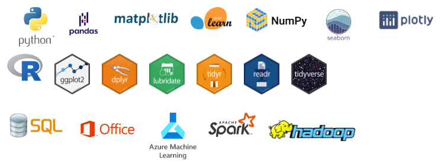

## Olá! Seja bem-vindo(a) ao meu repositório de projetos! 👋
[![LinkedIn][linkedin-shield]][linkedin-url]
[![WhatsApp][whatsapp-shield]][whatsapp-url]

## Eu sou Engenheiro Eletricista, Cientista de Dados e Analista de Dados!
- 📚 Vivendo em <em>learning mode</em>.
- 🥅 **Objetivos 2021**: Continuar os estudos para maiores contribuições em projetos de Ciência e Analise de Dados.
- ⚡ **Hobbies**: Adoro curtir o tempo vago com esposa e filho, apaixonado por natação e video-game!

## Linguagens, Bibliotecas e Ferramentas: 
<!-- Imagens -->

<!-- Python 

   
-->

<!-- R 

    
-->

<!-- Outros 

-->

## 🎧 Spotify Playing

## 📊 Estatísticas Github 

<!-- Github status -->

  
  
:zap: GitHub Stats

  
  
  

<!-- MARKDOWN LINKS & IMAGES -->
<!-- https://github.com/alexandresanlim/Badges4-README.md-Profile -->
[linkedin-shield]: https://img.shields.io/badge/LinkedIn-0077B5?style=for-the-badge&logo=linkedin&logoColor=white
[linkedin-url]: https://www.linkedin.com/in/paulopiai/

[whatsapp-shield]: https://img.shields.io/badge/WhatsApp-25D366?style=for-the-badge&logo=whatsapp&logoColor=white
[whatsapp-url]: https://api.whatsapp.com/send?phone=5511973763378
